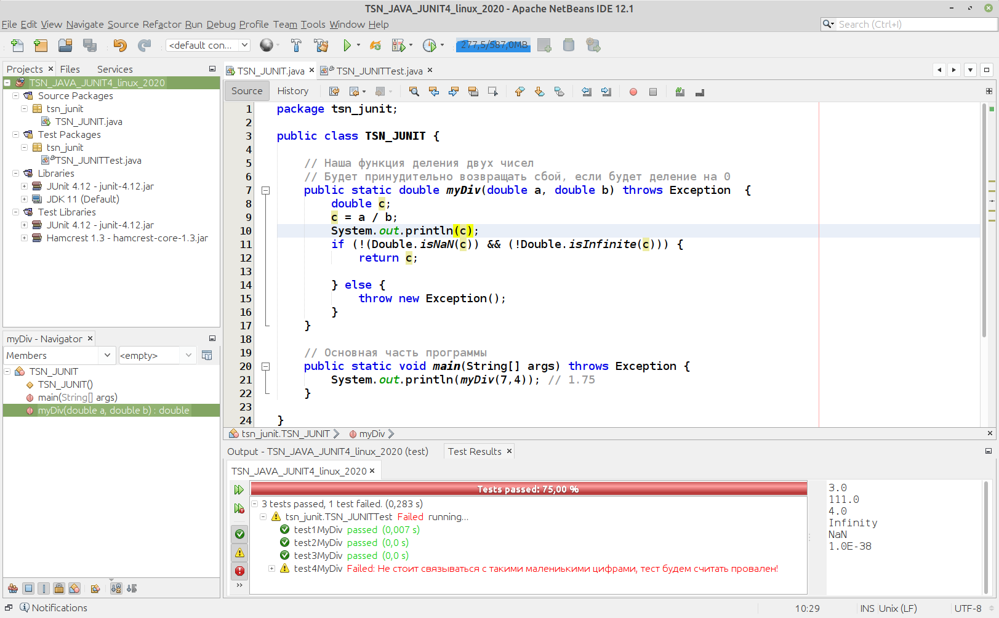
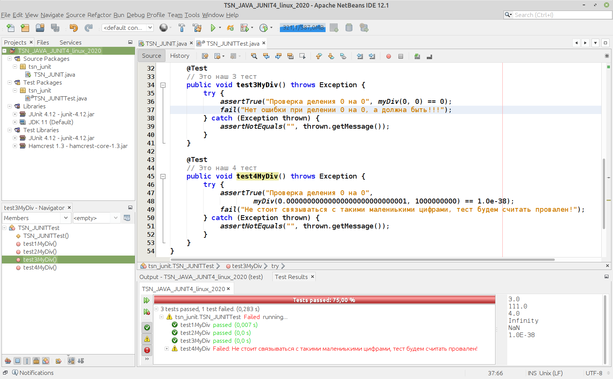

# TSN_JAVA_JUNIT4
Пример работы с модульными тестами JUNIT4 на Java в NetBeans





```
package tsn_junit;

public class TSN_JUNIT {

    // Наша функция деления двух чисел
    // Будет принудительно возвращать сбой, если будет деление на 0
    public static double myDiv(double a, double b) throws Exception  {
        double c;
        c = a / b;
        System.out.println(c);
        if (!(Double.isNaN(c)) && (!Double.isInfinite(c))) {
            return c;

        } else {
            throw new Exception();
        }
    }

    // Основная часть программы
    public static void main(String[] args) throws Exception {
        System.out.println(myDiv(7,4)); // 1.75
    }

}
```

```
package tsn_junit;

import org.junit.Test;
import static org.junit.Assert.*;

import static tsn_junit.TSN_JUNIT.myDiv;

public class TSN_JUNITTest {

    @Test
    // Это наш 1 тест
    public void test1MyDiv() throws Exception {
        assertTrue(myDiv(9, 3) == 3); // 9/3 ОБЯЗАНО ДЛЯ НАС БЫТЬ 3, иначе тест провален
        assertTrue(myDiv(777, 7) == 111); // 777/7 ОБЯЗАНО ДЛЯ НАС БЫТЬ 111, иначе тест провален
        // 100/25 ОБЯЗАНО ДЛЯ НАС БЫТЬ 4, иначе тест провален. Тест с примечанием для случая провала теста
        assertTrue("Проверка деления 100 на 25", myDiv(100, 25) == 4);
    }

    @Test
    // Это наш 2 тест
    public void test2MyDiv() throws Exception {
        try {
            assertTrue(myDiv(5, 0) == 0); // Этот тест должен получить ошибк от нашей функции myDiv
            // Если мы дошли до этого места, значит не возникла ошибка при делении на 0!
            fail("Нет ошибки при делении 0 на 0"); // Делаем принудительный провал теста с примечанием
        } catch (Exception thrown) {
            // Проверим еще, что ошибка не является пустой (есть ее описание), иначе провал теста  
            assertNotEquals("", thrown.getMessage());
        }
    }

    @Test
    // Это наш 3 тест
    public void test3MyDiv() throws Exception {
        try {
            assertTrue("Проверка деления 0 на 0", myDiv(0, 0) == 0);
            fail("Нет ошибки при делении 0 на 0, а должна быть!!!");
        } catch (Exception thrown) {
            assertNotEquals("", thrown.getMessage());
        }
    }

    @Test
    // Это наш 4 тест
    public void test4MyDiv() throws Exception {
        try {
            assertTrue("Проверка деления 0 на 0",
                    myDiv(0.00000000000000000000000000001, 1000000000) == 1.0e-38);
            fail("Не стоит связываться с такими малениькими цифрами, тест будем считать провален!");
        } catch (Exception thrown) {
            assertNotEquals("", thrown.getMessage());
        }
    }
}
```